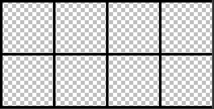
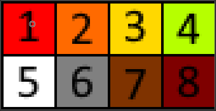
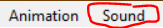

# PixelViewer
This is a simple executable app to run & display 'framed' pixel animations  to easily help me as I learn to improve my pixel art ability.
I am primarily pulling pixel tutorials from 

## Creating Your Own Animations
PixelPlayer will open & run any animation image(.PNG,.JPG ect. ect.) that has the following format:
Image 'Slides', drawn left-to right, going down. Only 4 'slides' per row.
Image'slides' being the same width&height.
Image 'slides' beign squares
Images 'slides' being surrounded by overlapping gaps, that are exactly (slide width /20)px thick.

A good way to create a pixel image is to create a new 84px x 43px image.
Create a 4x2 grid of 20x20px boxes surrounded by 1 px borders.

Going left to right, create the animtion frame-by-frame within those boxes

Resize the image to 1680 x 860 px.

Voila, you have created an 8 frame animation!

## Features(Planned In Brackets)

* Divides PNG/JPG images and plays the resulting set of images as a pixel animation *

* Plays selected .WAV files over animation * 

* File selection of animation *

* Custom Image sizes *

* Custom frame ammounts  *

* Variable animation frame speeds  *

## Latest  Build

1.0 - 19/05/20

## Next Update

N/A

## Next Build

N/A

## Skill developing

I plan on this project improving my skills in the following:

> Pixel art/animation primarily

> Quick, effective coding to solve problems.

> A post-COVD refresher on .md documentation.

> Windows forms graphics.

## Installing and Compiling:

**Requires a Windows operating system! As far as I know **

All files other than Anime.zip are for development purposes to look through my code.
To run the program, download Anime.zip, uncompress it and run PixelPlayer.exe 

The folder'Anime.zip' ( That can be downloaded : [!here](https://github.com/StarshipladDev/PixelViewer/raw/master/Anime.zip)) ,contains some sample .WAV files and compatible animation PNGs
as well as the .exe file to run the program.

To open an animation, press 'animation' in the toolbar, and select an appropriate image that follows guideline mentioned above.

To play audio over the animation, press the 'Sound' button  in the tool bar, and select a compatible .wav file.

This program will work with animations you create yourself, and some base files are included
